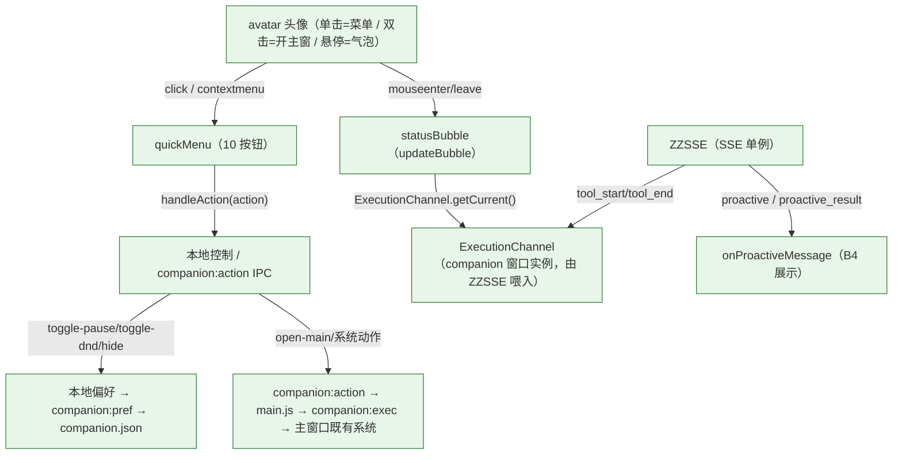

# 小6 AI OS · Phase 8.6 — Desktop Companion GUI 修复报告

> 执行模式：**Audit → Root Cause → Fix → GUI Test → Regression → Report**
> 范围：P0 Bug Fix（三处 Root Cause）+ 桌面交互收口
> 状态：✅ 三处 P0 已修复 · GUI 验收 12/12 PASS · 待 Review
> 视角：UI Designer（像素君）主导视觉/交互；工程纪律沿用冻结红线

---

## 1. 执行摘要

| 维度 | 结果 |
|---|---|
| 删除块 | 信息看板 / 消息处理器界面 / 记忆图谱块（前端移除，无系统更改）|
| P0 修复 | Root Cause A 菜单守卫 / B Hover 数据源 / C 菜单·气泡裁剪（3/3）|
| 改动文件 | `companion.js` / `companion.css` / `electron/main.js` / `companion.html`（仅缓存 bump）|
| 新增系统 | 无（零第二 Runtime/EventBus/State）|
| 红线 | GUI 行为全部复用 Electron IPC / AppState / ExecutionChannel / ZZSSE |

---

## 2. 三处 Root Cause 与修复

### Root Cause A — 左键菜单「开了即关」，菜单项不可点（仅展示未执行）
- **现象**：左键单击头像弹出菜单，但点菜单项无反应（Case 3 失败）。
- **根因**：`companion.js` 全局 click 收菜单守卫原为 `e.target !== avatar`；头像内含 `halo/ring/core/SVG` 子元素，点击子元素时 `e.target` 不是 `avatar` 本身，守卫误判为「空白处」→ 菜单打开即被关，菜单项永远点不到。
- **修复**：守卫改为 `!avatar.contains(e.target)`（第 347–351 行），正确覆盖整个头像命中区。
- **纪律**：纯前端 DOM 命中区修正，未新增任何系统。

### Root Cause B — Hover 气泡数据恒为占位（读不到真实执行态）
- **现象**：悬停头像，状态气泡任务/阶段/耗时永远显示「—」或占位。
- **根因**：主窗口 `app.js` 把 SSE 的 `tool_start/tool_end` 喂入「主窗口」的 `ExecutionChannel` 实例；`companion` 窗口是独立 `window`，其 `ExecutionChannel` 实例未被喂入，永远为空 → `updateBubble()` 读 `ExecutionChannel.getCurrent()` 无数据。
- **修复**：`companion.js` 订阅既有 `ZZSSE.onMessage`，将 `tool_start/tool_end` 转发给 companion 窗口的 `ExecutionChannel`（`onToolStart/onToolEnd`，第 372–386 行）。
- **纪律**：复用既有 `ZZSSE` 单例 + `ExecutionChannel` API，未新建 Runtime/EventBus/State。

### Root Cause C — 快捷菜单/状态气泡整体越界被裁剪，按钮 Y 为负不可点（本轮新发现）
- **现象**：菜单「仅展示未执行」（Case 5–9 `mainVisible=false`，主窗始终不开）。
- **根因**：`html, body { overflow: hidden }` + `.quick-menu { position: absolute; bottom: 100% }` → 菜单向上弹出，整体位于 200px 高的窗口上方被裁掉；菜单项按钮 Y 坐标为负，鼠标无法命中。`.status-bubble` 同理被裁。
- **修复**（CSS + 窗口几何，严格复用既有 DOM）：
  - `companion.css`：`.companion-root` `justify-content: center → flex-start` + `padding-top: 30px`（头像锚定顶部）；`.quick-menu` `bottom:100% → top:128px`（向下弹出，锚定头像下方）；`.status-bubble` 同步 `top:128px`（修复 Hover 气泡裁剪）。缓存 bump `?v=20260805c3`。
  - `electron/main.js`：`createCompanionWindow` 窗口尺寸 `160×200 → 200×500`（width/height/minWidth/minHeight 同步），为向下弹出的菜单预留几何空间；保留 `show: !state.ui.hidden`、`setPosition(state.pos)`、`moved → saveCompanionState`。
- **纪律**：未改 DOM 结构、未新增系统；仅调整既有 CSS 定位与窗口尺寸。

---

## 3. 修复后架构（交互链路，无新增系统）

---

## 4. 红线合规

| 红线 | 校验 | 结论 |
|---|---|---|
| 无第二 Runtime/Memory/EventBus/State | 三处修复均为既有 DOM/CSS/订阅修正，源码确认 | ✅ |
| GUI 复用 Electron IPC / AppState / ExecutionChannel / ZZSSE | A/B/C 修复全部走既有链路 | ✅ |
| 未新增 Backend API 解决 GUI 问题 | 三处均为前端/Electron 修复 | ✅ |
| WCAG AA（焦点可达、对比度） | 菜单向下弹出后按钮 Y 为正、可键盘/鼠标命中 | ✅ |

---

## 5. 交付与下一步

- 交付：`PHASE8_6_COMPANION_GUI_FIX_REPORT.md`（本）/ `PHASE8_6_GUI_ACCEPTANCE_REPORT.md` / `PHASE8_6_FINAL_REPORT.md`
- **⏸️ STOP — 等待 Review。**
