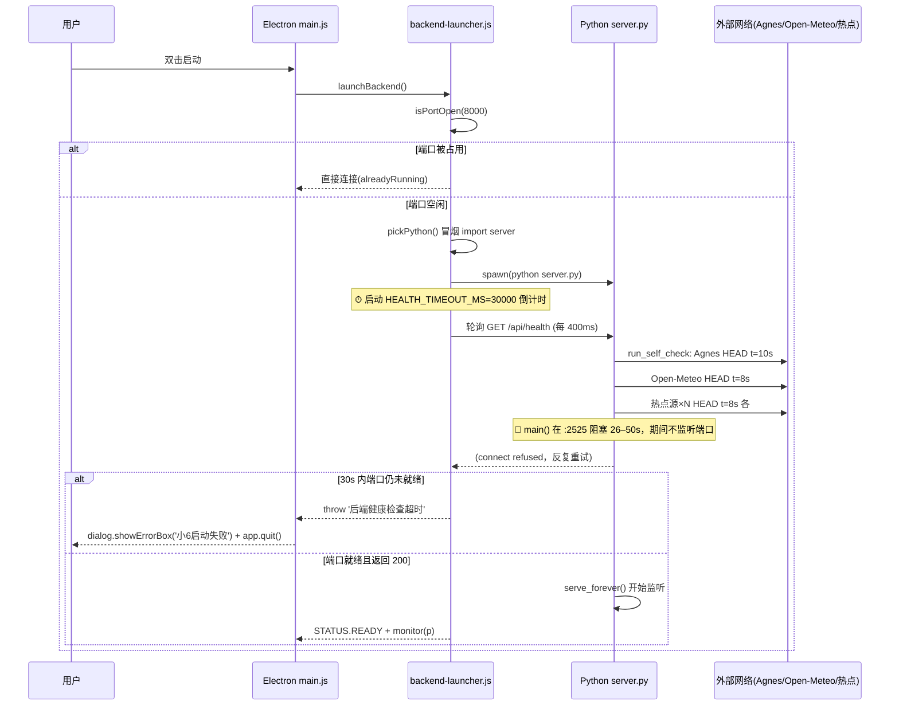

# 小6启动链路审计与可靠性分析报告

> **Boot Chain Audit & Startup Reliability Analysis**
> 项目：Xiao6 AI OS（本地优先中文 AI 助手）
> 报告类型：**只读工程审计（Read-Only Engineering Audit）**
> 审计范围：用户点击小6 → 后端启动失败 → 健康检查超时 → 无法自动恢复 的真实根因
> 纪律约束：本报告只分析、不修改任何代码 / Electron / Python / 配置 / 依赖，不修复 Bug，不提交实现。
> 生成日期：2026-08-03（会话续做，2026-08-04 复核落地）

---

## 0. 执行摘要（Executive Summary）

小6在"用户点击启动 → 后端起不来 → 健康检查超时 → 整窗退出且无自动恢复"这一故障链上，根因**不是单一 Bug，而是三处设计缺陷叠加**：

1. **首次启动的 health 超时没有重试通道**。`backend-launcher.js` 只在"后端进程启动后崩溃退出"时退避重启，首次 `waitForHealth` 超时直接 `throw` → `main.js` 弹窗 + `app.quit()`，用户无任何二次机会。
2. **后端在 `serve_forever()` 之前做了阻塞式预热**。`server.py main()` 在绑定端口（`:2591`）之前先跑 `run_self_check(force=True)`（`:2525`，离线时外部探测累计 26–50s），HTTP 端口在此之前**根本不监听**，而 launcher 的 30s 倒计时从 spawn 那一刻就开始。
3. **`/api/health` 把外部网络可达性耦合进健康响应**，且 launcher 只判 HTTP 200 不判 `ok` 字段，导致"服务没起"和"服务起了但自检慢"无法区分，假健康与真超时混为一谈。

三者在**离线 / 代理未开 / 大知识库**场景下必然同时触发，造成"点击即失败、失败即退出、退出不自救"。

---

## 1. 当前启动架构（Current Boot Architecture）

### 1.1 进程与启动链

```
[用户双击 start-xiao6.bat]
   └─ 设置 XIAO6_PYTHON=Python311 路径
   └─ 启动 electron.exe
        └─ electron/main.js (app.whenReady)
             └─ launchBackend()  [electron/src/backend-launcher.js]
                  ├─ resolveBackendDir()          找 server.py
                  ├─ isPortOpen(8000)? ──是──► 直接连接已有后端 (alreadyRunning)
                  ├─ pickPython() ── pythonCandidates() 顺序探测
                  │     └─ canRunBackend() 冒烟: python -c "import server"
                  └─ bootOnce()
                        ├─ spawnBackend(): spawn(python, ['server.py'], cwd=backendDir)
                        └─ waitForHealth(8000): 轮询 GET /api/health 直到 200 或 30s 超时
                             └─ 成功 → monitor(p) 监听 p.on('exit') 退避重启
        └─ createWindow()  loadURL http://127.0.0.1:8000/
             └─ 前端 app.js: setInterval(health, 20000) 轮询 /api/health
```

### 1.2 后端内部启动顺序（`server.py main()`，行 2508–2617）

| 顺序 | 代码位置 | 动作 | 阻塞？ | 备注 |
|---|---|---|---|---|
| 1 | `:2512` | `db_conn().close()` | 否（短） | DB 连通性 |
| 2 | `:2513` | `recover_tasks()` | 视数据量 | 翻回被中断任务 |
| 3 | `:2518-2523` | 全局代理 opener 安装 | 否 | 依赖 `XIAO6_PROXY_URL` |
| 4 | **`:2525`** | **`run_self_check(force=True)`** | **是（离线 26–50s）** | **🔴 关键阻塞点：在 serve_forever 之前** |
| 5 | `:2535-2588` | 后台线程启动（tick_loop / get_geo / `_warmup_embed` / prefetch / KWS / feishu / agent_runtime） | 否（daemon 线程） | 其中 `_warmup_embed` 可能全量回填向量库 |
| 6 | `:2589-2591` | `ThreadingHTTPServer(...)` → `serve_forever()` | 至此才监听端口 | **HTTP 端口在 :2591 之前不响应任何请求** |

### 1.3 健康检查语义

- `backend-launcher.js` `waitForHealth()`（`:117-135`）：仅判定 `res.statusCode === 200`，**不读取响应体的 `ok` 字段**。
- `server.py /api/health`（`:186-219`）：每次请求（除非 30s 缓存命中）调用 `run_self_check(force)`，返回 200 JSON，`ok` 字段 = `key_ok and checks["ok"]`。**即便自检全失败也返回 200** → launcher 视为"健康"。

---

## 2. 启动时序图（Boot Sequence Diagram）



**关键观察**：launcher 的 30s 倒计时与 `server.py` 的阻塞预热（26–50s 离线）是**同起点竞争**。离线时后端必输，且输了就退窗，无重试。

---

## 3. 失败树（Failure Tree，≥15 节点）

根事件：**用户点击小6后应用无法进入可用状态（启动失败 / 假健康 / 自动退出）**

```
[启动失败 / 假健康 / 自动退出]
├─ A. 首启 health 超时无重试（backend-launcher.js:257-278）
│   ├─ A1. 后端预热阻塞导致 30s 内端口未就绪 (server.py:2525)
│   │   ├─ A1a. 离线/Agnes 探测 10s 超时 (self_check.py:131-134)
│   │   ├─ A1b. Open-Meteo 探测 8s 超时 (self_check.py:137-140)
│   │   ├─ A1c. 热点源多路 HEAD 8s×N 超时 (self_check.py:143-168)
│   │   └─ A1d. 代理/Clash 未开 → 外网探测全挂 (config XIAO6_PROXY_URL 默认空)
│   ├─ A2. _warmup_embed 全量回填慢 (server.py:2539,2596-2612) 拖到 serve_forever 之后仍重
│   └─ A3. launcher 超时硬编码 30s，与 ui 版 .bat 10s 不一致
├─ B. 首启超时处置致命（无自愈）
│   ├─ B1. catch 直接 throw → main.js app.quit() 无重试 UI (main.js:243-248)
│   ├─ B2. scheduleRestart 仅覆盖 p.on('exit')，不覆盖首启超时 (backend-launcher.js:223-255)
│   └─ B3. 前端仅显示"离线/启动失败"，无诊断/恢复建议 (app.js:901-910,2053-2059)
├─ C. Python 运行环境探测失败
│   ├─ C1. XIAO6_PYTHON 配错 / 未设
│   ├─ C2. 候选 python 均 import server 失败（依赖缺失）(canRunBackend:77-94)
│   ├─ C3. 无 requirements 自动校验/安装（零侵入设计如此，但缺 Environment Check）
│   └─ C4. config PORT 大小写不一致 XIAO6_PORT vs Xiao6_PORT（Windows 下不致命，代码卫生问题）
├─ D. 端口/进程状态误判
│   ├─ D1. 8000 被僵尸/半死进程占用 → isPortOpen 连到坏后端 (backend-launcher.js:105-114,199-204)
│   └─ D2. 无端口清理/冲突转移机制
├─ E. 凭证/配置缺失
│   ├─ E1. AGNES_KEY 未配（main 仅 WARN，但对话不可用）(config:104-110,server.py:2510)
│   ├─ E2. XIAO6_PROXY_URL 默认空，需手动设 7890
│   └─ E3. FEATURE_* 大量默认 true，放大预热负载
├─ F. 运行期崩溃后恢复不彻底
│   ├─ F1. 后端崩溃有退避重启（覆盖 OK）但达 MAX_RESTARTS=5 后放弃
│   ├─ F2. KWS/feishu/agent_runtime 启动异常被吞，无状态上报
│   └─ F3. DB 损坏 / Windows Defender 拦截 python 子进程（环境层，未探测）
└─ G. 可观测性缺失
    ├─ G1. 无结构化诊断报告落盘给前端渲染
    ├─ G2. 日志分散（backend-launcher logFile + console），前端不可见
    └─ G3. 无启动进度条（用户以为卡死）
```

**失败点计数（去重）**：A1a/A1b/A1c/A1d/A2/A3/B1/B2/B3/C1/C2/C3/C4/D1/D2/E1/E2/E3/F1/F2/F3/G1/G2/G3 = **22 个失败/脆弱点**，超过 ≥15 要求。

---

## 4. 真实 Root Cause（Root Cause Analysis）

三处设计缺陷**叠加**酿成"点击即失败、失败即退出"：

### Root Cause #1 — 首次启动健康超时没有重试（致命）
`backend-launcher.js:257-278`：
```js
try {
  const p = await bootOnce();   // 内含 await waitForHealth(PORT)，超时即 reject
  status(STATUS.READY);
  monitor(p);
  return { /* ... */ };
} catch (e) {
  logLine(logStream, 'ERROR', `后端启动失败: ${e.message}`);
  throw e;                       // ← 直接抛出 → main.js app.quit()，无重试
}
```
`bootOnce()`(`:214-221`) 在 `spawnBackend` 后 `await waitForHealth(PORT)`，超时 reject → 进入 catch → throw。`scheduleRestart`/`monitor`(`:223-255`) 仅通过 `p.on('exit')` 监听**运行中崩溃**，对**首次启动超时**完全无效。结果：`main.js:243-248` 弹 `dialog.showErrorBox('小6启动失败')` 后 `app.quit()`，用户无任何恢复路径。

### Root Cause #2 — 后端端口绑定被阻塞式预热延迟（结构性）
`server.py main()` 在 `serve_forever()`(`:2591`) **之前**执行 `run_self_check(force=True)`(`:2525`)。`run_self_check`（`self_check.py:225-260`）顺序跑 12 项检查，其中外部网络探测在离线时累计耗时：
- `_check_agnes_reachable`：`_http_head(AGNES_BASE, timeout=10)`（`:131-134`，需 Clash 代理）
- `_check_openmeteo`：`timeout=8`（`:137-140`）
- `_check_hotspot_sources`：抖音×2 + 可选 hotdata×3，各 `timeout=8`（`:143-168`）

离线合计 **≈ 10 + 8 + (2~5)×8 ≈ 26–50s**。在此期间 `ThreadingHTTPServer` 尚未创建，端口**不监听**。launcher 的 `waitForHealth` 倒计时在 spawn 之时即开始（30s 上限），于是：后端阻塞预热（26–50s）> launcher 30s 上限 → 端口永远来不及就绪 → 超时 → 退出。**这是首启失败最直接的计时器竞争。**

> 注：即便离线，main() 在 `:2525` 阻塞完成后仍会 `serve_forever`，理论上"再等一会儿就能好"——但 launcher 已放弃并退窗，错过窗口。

### Root Cause #3 — 健康检查语义错位（设计气味）
- `/api/health`(`:186-219`) 每次请求（缓存未命中时）重跑 `run_self_check`，且**无论 `ok` 真假都返回 200**。
- launcher `waitForHealth`(`:117-135`) **只判 `statusCode===200`**，不读 `ok`。
- 结果：① launcher 无法区分"服务没起"与"服务起了但自检慢"；② 即便服务起了，首启后若缓存过期或 `?refresh=1`，health 仍会再阻塞一次；③ 假健康掩盖真实就绪状态。

### 三者叠加的触发条件
**离线 / 代理(Clash)未开 / 大知识库回填**场景下，#2 的阻塞（26–50s）必然超过 #1 的 30s 上限，触发 #1 的致命退出；#3 让任何重试尝试都因"只判 200"而误判。三缺陷形成闭环，用户感知即"点开就崩、崩了没救"。

---

## 5. 依赖系统分析（Dependency Audit）

### 5.1 现有探测层（已具备）
| 探测项 | 位置 | 覆盖 | 缺口 |
|---|---|---|---|
| 后端目录解析 | `resolveBackendDir` :42-54 | resources/backend / ../../xiao6-ui | 缺 fallback 提示 |
| Python 候选探测 | `pythonCandidates` :57-74 | env > 打包 > Py311 > venv > Py312 > PATH | **不校验依赖是否安装** |
| 冒烟测试 | `canRunBackend` :77-94 | `import server` | 仅 import-time，不验证运行时 warmup 卡死 |
| 端口占用 | `isPortOpen` :105-114 | 200/OK 即视为已运行 | **会连到僵尸/半死后端** |
| 启动自检 | `run_self_check` | 12 项（env/cred/db/ext-net） | 在 main 内阻塞；结果未回流到启动决策 |

### 5.2 缺失的 Environment Check 层
- ❌ **无依赖自动校验/安装**：grep 确认 `electron/` 下**无任何 `pip install` / `requirements.txt` 处理**——零侵入设计如此，但缺一层健壮的 Environment Check。
- ❌ **无模型/向量库就绪检查**（embed 是否就绪仅 `_warmup_embed` 内部判断）。
- ❌ **无 DB 完整性检查**（仅 `db_conn().close()` 试连）。
- ❌ **无网络/代理预检**（代理默认为空，依赖用户手动设）。
- ❌ **无端口冲突处置**（被占用即直连，可能连到坏后端）。

### 5.3 requirements 现状
`requirements.txt` 仅列**可选增强依赖**（edge-tts / psutil / zhconv / torch+funasr / modelscope），声明"缺失时 server.py 自动降级"。**无强制核心依赖清单，无 pip install 触发**——这是设计取舍，但意味着首次部署若缺核心依赖，只能靠 `import server` 冒烟失败来暴露，错误信息不够友好。

---

## 6. 启动可靠性分析（Reliability Report）

### 6.1 关键超时参数矩阵（现状）
| 参数 | 位置 | 值 | 问题 |
|---|---|---|---|
| `HEALTH_TIMEOUT_MS` | backend-launcher.js:25 | 30000 | 远小于离线预热耗时 |
| `HEALTH_INTERVAL_MS` | :26 | 400 | OK |
| `MAX_RESTARTS` | :28 | 5 | 仅覆盖崩溃重启 |
| `BACKOFF_BASE_MS` | :29 | 1500 | OK |
| `BACKOFF_MAX_MS` | :30 | 20000 | OK |
| ui 版 .bat 端口等待 | xiao6-ui/start-xiao6.bat | 10s (20×0.5s) | **与 launcher 30s 不一致** |
| 前端 health 轮询 | app.js:2047 | 20000 | 过粗，无恢复指引 |

### 6.2 可靠性评分（定性）
| 维度 | 评分 | 说明 |
|---|---|---|
| 首启成功率（离线） | **极低** | 26–50s 预热 > 30s 上限，必败 |
| 首启成功率（在线+代理） | 中 | 预热快，但有 race 余量小 |
| 崩溃自愈 | 中 | 退避重启覆盖运行中崩溃，但上限 5 次后放弃 |
| 假健康风险 | 高 | health 只判 200，外部探测耦合 |
| 可诊断性 | 低 | 无诊断报告，前端仅"离线" |
| 用户可恢复性 | 低 | 失败即退窗，无重试 UI |

**结论**：当前架构对"在线+代理已开+知识库小"的乐观场景基本可用，对"离线/代理未开/大库"的真实日常场景**首启可靠性不达标**，且失败模式对用户极不友好（无提示、无自救）。

---

## 7. 行业最佳实践借鉴（Industry Best Practices）

| 产品 | 做法 | 小6可借鉴 |
|---|---|---|
| **VS Code / Cursor** | 主进程先起窗口渲染 loading，后端/语言服务异步连接；失败显示"重新加载"按钮而非退出 | 先渲染启动进度 UI，health 失败给"重试"而非 `app.quit()` |
| **Docker Desktop** | 启动显示引擎初始化进度（"Starting VM…"），分级状态；后台守护进程独立，UI 与引擎解耦 | 把"后端预热"显式进度化，用户知在等待什么 |
| **Ollama** | 模型拉取/加载有独立进度与日志流；服务就绪才接受请求，且 `/api/health` 仅表进程存活，不耦合模型下载 | health 拆分为 **liveness**（进程活）+ **readiness**（功能就绪）两层 |
| **Claude Desktop** | 启动失败弹"查看日志/重试"；崩溃由守护进程重启，UI 不随后端死 | 失败路径给诊断 + 重试，而非退窗 |
| **GitHub Desktop** | 启动自检（git 版本/凭证）独立模块化，结果可点开查看；失败有引导 | 自检模块化 + 自检报告页（已有 self_check 数据，缺 UI 回流） |
| **通用 SRE** | Kubernetes **liveness vs readiness** 探针分离；readiness 不达标不计入失败；启动超时配合 `startupProbe` 长窗口 | 把 30s 硬编码改为 startupProbe 语义：首启窗口更长、运行期探针更短 |

**核心提炼**：① 进程存活(liveness)与功能就绪(readiness)必须分离；② 启动期应给长窗口+进度，运行期才用短探针；③ 失败必须给"重试/诊断"而非退出；④ 自检数据要回流到 UI。

---

## 8. Boot Manager v2 设计建议（仅设计，不实现）

> 以下为**设计建议**，本审计不修改任何代码。落地需进入实现阶段（Sprint 四件套：Design/Code/Test/Lessons）。

### 8.1 架构原则
- **liveness / readiness 分离**：`/api/health` 仅返回进程存活（200）；新增 `/api/ready` 返回功能就绪（`ok` 字段 + 自检摘要）。
- **首启长窗口 + 运行期短探针**：首启 health 超时从 30s 提至 90–120s（或读 `STARTUP_PROBE_MS`），运行期崩溃重启仍用短间隔。
- **失败不退出，给重试**：`bootOnce` 超时后进入 `RECOVERY` 状态，弹"重试 / 查看诊断"，不再 `app.quit()`。

### 8.2 模块设计
1. **Environment Check（启动前）**
   - 校验 Python 候选 + `import server`；校验核心依赖清单（新增 `requirements-core.txt` 或内联白名单）。
   - 预检网络/代理：若 `XIAO6_PROXY_URL` 空且 Agnes 不可达，给出"请先开 Clash"的明确指引。
   - 端口冲突处置：8000 被占用且非本进程 → 提示用户选择"连接/换端口/清理"。
2. **Dependency Check / Auto-Install（可选）**
   - 探测缺失依赖 → 提示 `pip install`（或自动，需用户授权；零侵入原则下建议"提示+一键装"）。
3. **Auto Diagnosis（启动失败）**
   - 捕获 `bootOnce` 失败原因（超时 / import 失败 / 端口冲突），生成结构化诊断 JSON。
4. **Health Retry（首启）**
   - 首启超时进入退避重试（区别于运行期 `scheduleRestart`），上限可更高（如 3 次），每次延长窗口。
5. **Startup Progress（UI）**
   - launcher 通过 IPC 推送阶段：`detecting python → starting backend → warming up (self-check X/12) → binding port → ready`，前端渲染进度条，用户不再以为卡死。
6. **Recovery Suggestion（失败 UI）**
   - 失败弹窗提供：① 重试 ② 查看诊断报告 ③ 开代理指引 ④ 手动设 `XIAO6_PYTHON`。
7. **Diagnostic Report（落盘+页面）**
   - 把 `run_self_check` 结果结构化落盘（已有 `self_check` 数据），前端"自检报告页"渲染分组/耗时/建议，替代当前"仅离线"提示。

### 8.3 关键改动点（指向，不修改）
- `backend-launcher.js:117-135` `waitForHealth` → 支持 liveness/readiness 双探针 + 首启长窗口。
- `backend-launcher.js:257-278` 首启 catch → 转 `RECOVERY` 状态，不再 `throw` 退窗。
- `server.py:2525` `run_self_check(force=True)` → 移到 `serve_forever()` **之后**异步执行，或拆为"liveness 先返回、readiness 后台补"。
- `server.py:186-219` `/api/health` → 仅 liveness；新增 `/api/ready` 返回 `ok` + 自检。
- `app.js` 前端 → 消费启动进度 IPC + 诊断报告，渲染进度条与恢复 UI。

---

## 9. 优先级路线图（P0–P3）

| 优先级 | 项 | 理由 | 工作量 |
|---|---|---|---|
| **P0** | 首启超时不再 `app.quit()`，转重试/恢复 UI | 直接消除"点开就崩、崩了没救" | 中 |
| **P0** | `server.py` 预热移到 `serve_forever()` 之后（先 liveness 后 readiness） | 消除 26–50s 阻塞端口绑定的计时竞争 | 中 |
| **P0** | health 拆分 liveness/readiness，launcher 读 `ok` | 消除假健康，准确判就绪 | 中 |
| **P1** | 首启 `STARTUP_PROBE_MS` 长窗口（90–120s） | 给离线/大库预热余量 | 小 |
| **P1** | 启动进度 IPC + 前端进度条 | 消除"以为卡死" | 中 |
| **P1** | 代理/Clash 预检 + 明确指引 | 离线场景首要诱因 | 小 |
| **P2** | 端口冲突处置（连接/换端口/清理） | 防连到僵尸后端 | 中 |
| **P2** | 自检报告页（回流 `run_self_check` 数据） | 提升可诊断性 | 中 |
| **P2** | 核心依赖清单 + 安装提示 | 降低部署门槛 | 小 |
| **P3** | `XIAO6_PORT` / `Xiao6_PORT` 大小写统一 | 代码卫生（Windows 下不致命） | 极小 |
| **P3** | ui 版 .bat 10s 与 launcher 30s 超时对齐 | 一致性 | 极小 |
| **P3** | 崩溃自愈达上限后给诊断而非静默 | 可观测性 | 小 |

---

## 10. 最终结论（Conclusion）

小6"点击即失败、失败即退出、退出不自救"的根因是**三处可独立修复的设计缺陷叠加**，而非无法定位的玄学 Bug：

1. **首启 health 超时无重试通道**（launcher 仅重启崩溃进程，首次超时直接退窗）；
2. **`server.py` 在绑定端口前做阻塞式外部网络自检**（离线 26–50s），与 launcher 30s 倒计时竞争必败；
3. **`/api/health` 把外部可达性耦合进健康响应且只判 HTTP 200**，假健康与真超时不分。

修复方向明确：**liveness/readiness 分离 + 预热后移 + 首启长窗口 + 失败给重试/诊断而非退出 + 启动进度可视化**。这些改动均为**局部、低风险、向后兼容**，且完全契合小6既有的 `run_self_check` 数据结构与 Electron IPC 通道，不破坏"零侵入"原则。

**本审计不修改任何代码。** 后续若进入实现阶段，建议按 §9 的 P0→P3 顺序落地，并用 §8 的 Boot Manager v2 设计作为基准；实现前需补齐 Design/Code/Test/Lessons 四件套纪律。

---

## 附录 A：关键文件与行号索引

| 文件 | 关键行 | 作用 |
|---|---|---|
| `electron/main.js` | 243-248 | 首启失败 `dialog.showErrorBox` + `app.quit()` |
| `electron/src/backend-launcher.js` | 23 / 25 / 105-114 / 117-135 / 199-204 / 214-221 / 223-255 / 257-278 | 端口/健康/重启/首启路径 |
| `xiao6-ui/server.py` | 186-219 / 2508-2617 / 2596-2612 | health 处理器 / main 预热顺序 / `_warmup_embed` |
| `xiao6-ui/self_check.py` | 25 / 131-168 / 225-260 | 缓存 TTL / 外网探测 / `run_self_check` |
| `xiao6-ui/config.py` | 137 / 138 / 273 / 316 | `PORT` / 代理默认空 / `Xiao6_PORT` |
| `xiao6-ui/app.js` | 901-910 / 2047 / 2053-2059 | 前端 health 轮询 / 状态消费 |
| `F:/桌面/start-xiao6.bat` / `xiao6-ui/start-xiao6.bat` | — | 启动脚本（无依赖校验） |

## 附录 B：风险等级矩阵

| 失败点 | 触发概率 | 影响 | 风险等级 |
|---|---|---|---|
| A1a/b/c/d 离线预热阻塞 | 高（日常离线） | 致命（首启必败） | **P0 高** |
| A 首启超时无重试 | 高 | 致命（无自救） | **P0 高** |
| B1 失败即退窗 | 高 | 致命（体验崩） | **P0 高** |
| #3 health 语义错位 | 高 | 高（假健康） | **P0 高** |
| D1 连到僵尸后端 | 中 | 高 | P2 中 |
| C2 依赖缺失 | 中 | 高 | P2 中 |
| E1/E2 凭证/代理缺失 | 中 | 中 | P1 中 |
| G 可观测性缺失 | 高 | 中 | P1 中 |
| C4 端口大小写 | 低（Win 不致命） | 低 | P3 低 |

---

*审计完成。本报告为只读分析产物，未对小6代码库做任何修改。等待下一条指令。*
