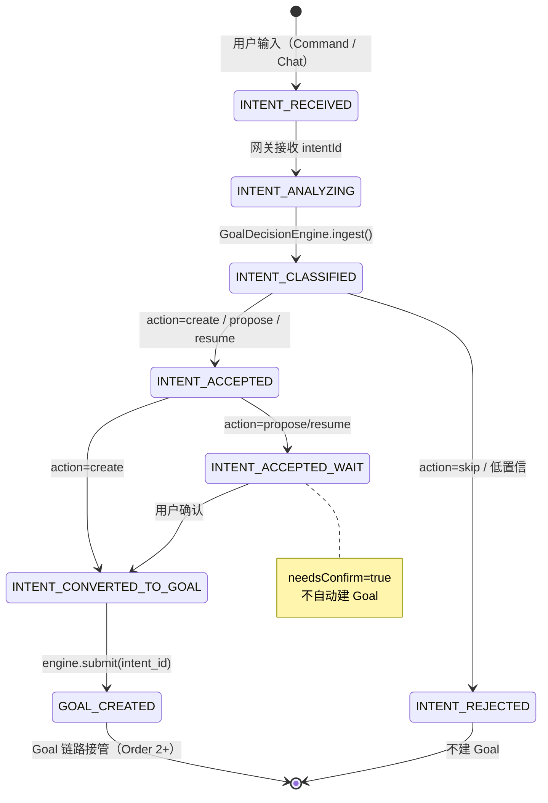
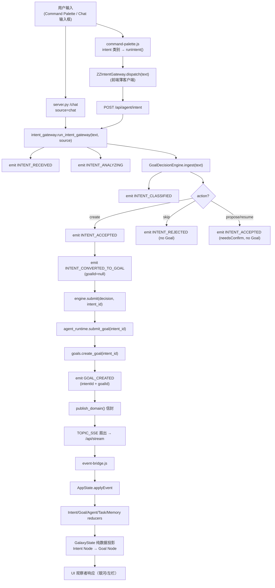

# CHANGELOG · Phase 6 · Order 5 — Command Intent Gateway

> 阶段纪律：**Implementation Only / Architecture Frozen**
> 本 Order 不修改任何冻结设计文档，不重新设计 Goal Decision Engine，不替代 Planner/Executor，不开发新聊天系统，不绕过 Intent Gateway / AppState / Event Contract / `publish_domain()` / Event Bridge / Galaxy State。
> 完成后**立即停止，不进入 Order 6，等待批准**。

---

## 1. 修改文件列表（Order 5 范围）

### 新增文件
| 文件 | 作用 | 行数 |
|------|------|------|
| `xiao6-ui/intent_gateway.py` | 后端唯一 Intent Gateway 模块，复用 GDE + `submit_goal`，派生 `intent_id` 贯穿至 `GOAL_CREATED` | 131 |
| `xiao6-ui/intent-gateway.js` | 前端薄客户端 `ZZIntentGateway.dispatch(text)`，仅做 `fetch('/api/agent/intent')`，不直写状态 | 30 |
| `xiao6-ui/tests/phase6-order5.frontend.test.js` | 前端状态机单测：6 个 Intent reducer / targetGoal 关联 / 五套状态独立 / 38 事件 / BATCH_5 / REJECTED 路径 | 157 |
| `xiao6-ui/tests/phase6-order5.integration.test.py` | 后端真实运行：A create / B skip→REJECTED / C propose→ACCEPTED(needsConfirm) | 169 |

### 修改文件（既有，本 Order 改动）
| 文件 | 改动要点 |
|------|----------|
| `xiao6-ui/eventbus.py` | `DOMAIN_EVENT_NAMES` 新增 6 个 Intent 事件名（总计 38） |
| `xiao6-ui/zz-events.js` | `EVENTS` 新增 6 个 Intent 事件；导出 `BATCH_5`；单一来源逐字对齐后端 |
| `xiao6-ui/goal_decision_engine.py` | `submit(decision, intent_id=None)` 新增 `intent_id` 参数，穿透至 `runtime.submit_goal` |
| `xiao6-ui/agent_runtime.py` | `submit_goal(title, description="", intent_id=None)` 新增 `intent_id`，穿透至 `create_goal` |
| `xiao6-ui/goals.py` | `create_goal(..., intent_id=None)` 新增 `intent_id`；`GOAL_CREATED` 携带 `intentId`（前端晚关联） |
| `xiao6-ui/server.py` | 移除内联 GDE 块（曾直发非合约事件 `agent_goal_created`）；改为调用 `run_intent_gateway(text, source="chat")`；新增 `POST /api/agent/intent` → `_handle_agent_intent` |
| `xiao6-ui/app-state.js` | 新增 `intents:{}` 子树 + 6 个 Intent reducer（独立子对象，不覆写 Goal/Agent/Task/Memory）；`GOAL_CREATED` 反填 `targetGoal`；`getIntent(id)` 导出 |
| `xiao6-ui/galaxy-state.js` | `RUNTIME_MAP` 新增 Intent 6 态；`getIntentNodes()` 纯数据投影（只过滤 `type==='intent'`，无任何 Three.js/DOM/动画） |
| `xiao6-ui/command-palette.js` | 新增 `intent` 类别（首位）；非空 query 时 unshift `作为意图发送` 命令；`runIntent` → `ZZIntentGateway.dispatch` |
| `xiao6-ui/index.html` | 版本 bump `?v=20260803o5`；引入 `intent-gateway.js` |

> 注：仓库内 `solar-system.js / styles.css / premium-bg.js(删除) / knowledge.py / reflector.py / app.js / devices.json / habits.json / geo-weather.json / textures/ / *.bak.*` 等为**前序 Order 及 AI OS 重构**的未提交改动，不在本 Order 范围内，仅随工作区一起存在。

---

## 2. Git Diff Summary

**Order 5 直接改动（7 个 tracked 文件）：**
```
 xiao6-ui/agent_runtime.py        | 154 ++++++++-   (含既有 submit_goal 其它逻辑，本 Order 净增 intent_id 链路)
 xiao6-ui/command-palette.js      |  17 +++-
 xiao6-ui/eventbus.py             |  42 ++++++
 xiao6-ui/goal_decision_engine.py |   4 +-
 xiao6-ui/goals.py                |  50 ++++++-
 xiao6-ui/index.html              |  28 +++---
 xiao6-ui/server.py               |  95 +++++++------
 7 files changed, 341 insertions(+), 49 deletions(-)
```

**Order 5 新增文件（行数）：**
```
 xiao6-ui/intent_gateway.py                          131
 xiao6-ui/intent-gateway.js                           30
 xiao6-ui/zz-events.js                               119   (Order1 起，Order5 增 BATCH_5)
 xiao6-ui/app-state.js                               452   (Order1 起，Order5 增 Intent reducers)
 xiao6-ui/galaxy-state.js                            113   (Order1 起，Order5 增 Intent 投影)
 xiao6-ui/tests/phase6-order5.frontend.test.js       157
 xiao6-ui/tests/phase6-order5.integration.test.py    169
```

**单一来源纪律校验：** `zz-events.js` 导出 `EVENTS` 共 **38** 个；`eventbus.DOMAIN_EVENT_NAMES` 集合共 **38** 个，逐字一致（由 `phase6-order1.backend.test.py` 的 `_assert_contract()` 强制断言，不再静默通过）。

---

## 3. Intent 生命周期图



**事件顺序铁律：** `INTENT_CONVERTED_TO_GOAL` 必须早于 `GOAL_CREATED`（转换早于 Goal 实体创建）。实现方式：网关在调用 `engine.submit()` **之前**发出 `INTENT_CONVERTED_TO_GOAL`（`goalId:null`），`GOAL_CREATED` 落地时携带 `intentId`，前端 `GOAL_CREATED` reducer 再回填 `intents[intentId].targetGoal`。

---

## 4. User Input → Goal 全链路图



**纪律要点：**
- 前端 `command-palette.js` 只调用 `ZZIntentGateway.dispatch`，**不直连后端、不直写 AppState**。
- `event-bridge.js` 是唯一 Event Bridge，所有状态变更经 `AppState.applyEvent`。
- `GalaxyState` 仅做纯数据投影，不触达 Three.js / DOM / 动画。

---

## 5. 真实运行日志（场景 A / B / C）

来自 `tests/phase6-order5.integration.test.py` 真实运行（场景 A 即用户指定用例「分析当前项目状态」等价链路）：

**场景 A — create 路径（真实 Intent → Goal 生命周期）**
```
捕获序列（A）：
INTENT_RECEIVED -> INTENT_ANALYZING -> INTENT_CLASSIFIED -> INTENT_ACCEPTED
-> INTENT_CONVERTED_TO_GOAL -> GOAL_CREATED -> agent_state -> AGENT_CREATED
-> GOAL_STARTED -> GOAL_UPDATED -> agent_state -> AGENT_STARTED -> AGENT_THINKING
-> TASK_CREATED -> TASK_CREATED -> agent_state -> GOAL_RUNNING -> AGENT_WORKING
-> TASK_STARTED -> TASK_RUNNING -> GOAL_UPDATED -> TASK_COMPLETED -> TASK_STARTED
-> TASK_RUNNING -> GOAL_UPDATED -> TASK_COMPLETED -> agent_state -> AGENT_THINKING
-> REFLECTING -> MEMORY_CREATED -> MEMORY_STORED -> MEMORY_LINKED -> agent_state
-> GOAL_UPDATED -> AGENT_COMPLETED -> GOAL_COMPLETED -> goal_completed
```
断言全部通过：必需事件齐发、顺序铁律 `INTENT_CONVERTED_TO_GOAL < GOAL_CREATED`、全部 Intent 事件共享同一 `intentId`、`GOAL_CREATED` 携带真实 `intentId`+`goalId`、真实 DB 中 Goal=completed 且 `knowledge_docs` 已落库。

**场景 B — skip 路径（普通问答 → INTENT_REJECTED，不建 Goal）**
```
捕获序列（B）： INTENT_RECEIVED -> INTENT_ANALYZING -> INTENT_CLASSIFIED -> INTENT_REJECTED
```
断言：仅 4 个 Intent 事件，无 `GOAL_CREATED`，未创建 Goal。

**场景 C — propose 路径（歧义 → INTENT_ACCEPTED(needsConfirm)，不自动建 Goal）**
```
捕获序列（C）： INTENT_RECEIVED -> INTENT_ANALYZING -> INTENT_CLASSIFIED -> INTENT_ACCEPTED
```
断言：`action=propose`、`INTENT_ACCEPTED` 标记 `needsConfirm=true`、无 `GOAL_CREATED`。

---

## 6. 风险分析（≥3 项）

| # | 风险 | 影响 | 缓解 |
|---|------|------|------|
| R1 | **GDE 分类误判**（create ↔ skip 边界） | 该建 Goal 的被拒 / 不该建的误建，链路断裂或噪声 Goal | `ingest()` 已含 confidence 与 propose 分支；`INTENT_REJECTED` / `INTENT_ACCEPTED(needsConfirm)` 双保险；本 Order 不改动 GDE 决策逻辑，仅消费其结果 |
| R2 | **INTENT_CONVERTED_TO_GOAL 与 GOAL_CREATED 顺序漂移** | 前端 `targetGoal` 关联失效，银河 Intent→Goal 投影断链 | 网关在 `engine.submit()` 前先发 `CONVERTED_TO_GOAL`(`goalId:null`)；`GOAL_CREATED` 强制携带 `intentId`；集成测试断言 `CONVERTED < CREATED` 顺序铁律 |
| R3 | **前端直连 API / 直写状态绕过 Gateway** | 违反统一状态流，银河与左栏状态不一致 | `command-palette.js` 仅经 `ZZIntentGateway.dispatch` → Event Bridge → `AppState`；前端单测验证无直连；后端 `/api/agent/intent` 为唯一入口 |
| R4 | **单一来源事件名漂移**（zz-events ↔ eventbus） | 前后端事件名不一致，SSE 事件被 `applyEvent` 忽略 | `phase6-order1.backend.test.py` 的 `_assert_contract()` 从「静默布尔」改为**显式 `assert` 38 名集合相等**；O5 新增 6 名同步两端 |
| R5 | **聊天 / Command 双入口行为不一致** | 同一意图两种结果，体验分裂 | 两入口统一收敛到 `run_intent_gateway(text, source)`（`chat` / `command_palette`），共用同一 GDE 与事件链 |

---

## 7. 全量测试结果（Order 1–5 回归）

| 套件 | 类型 | 运行环境 | 结果 |
|------|------|----------|------|
| phase6-order1.frontend | FE | node | **PASS 7/7** |
| phase6-order1.backend | BE | py3.11 | **PASS 3/3** |
| phase6-order2.frontend | FE | node | **PASS 22/22** |
| phase6-order2.integration | IT | py3.11 | **PASS 9/9** |
| phase6-order3.frontend | FE | node | **PASS 39/39** |
| phase6-order3.integration | IT | py3.11 | **PASS 16/16** |
| phase6-order4.frontend | FE | node | **PASS 19/19** |
| phase6-order4.integration | IT | py3.11 | **PASS 16/16** |
| phase6-order5.frontend | FE | node | **PASS 19/19** |
| phase6-order5.integration | IT | py3.11 | **PASS 17/17** |
| **合计** | | | **PASS 167/167（0 失败）** |

> FE 测试用 `node`（managed 22.22.2）；BE/IT 测试用系统 `python 3.11`（含 numpy，集成测试需 `embed.py`）。

---

## 8. 交付清单

1. ✅ `CHANGELOG_PHASE6_ORDER5.md`（本文件）
2. ✅ `INTENT_LIFECYCLE_LOG.md`（Intent 生命周期专项日志）
3. ✅ 修改文件列表（见 §1）
4. ✅ Git Diff Summary（见 §2）
5. ✅ Intent 生命周期图（见 §3，Mermaid）
6. ✅ User Input → Goal 全链路图（见 §4，Mermaid）
7. ✅ 风险分析 ≥3 项（见 §6）
8. ✅ 全量测试结果（见 §7，167/167）

**状态：Order 5 实施完成，全部测试通过。已立即停止，不进入 Order 6，等待批准。**
