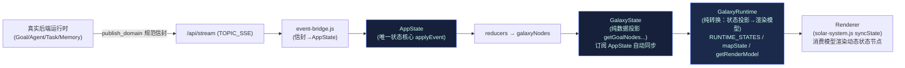
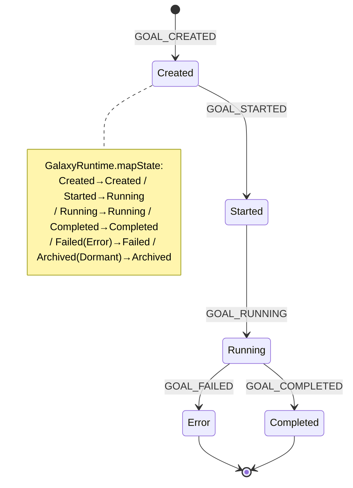
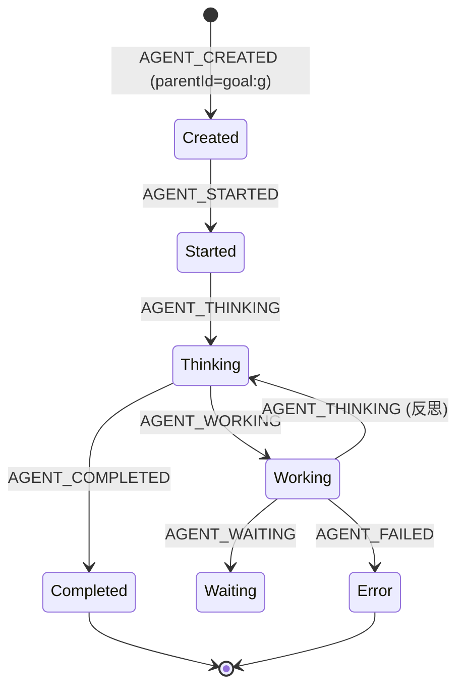
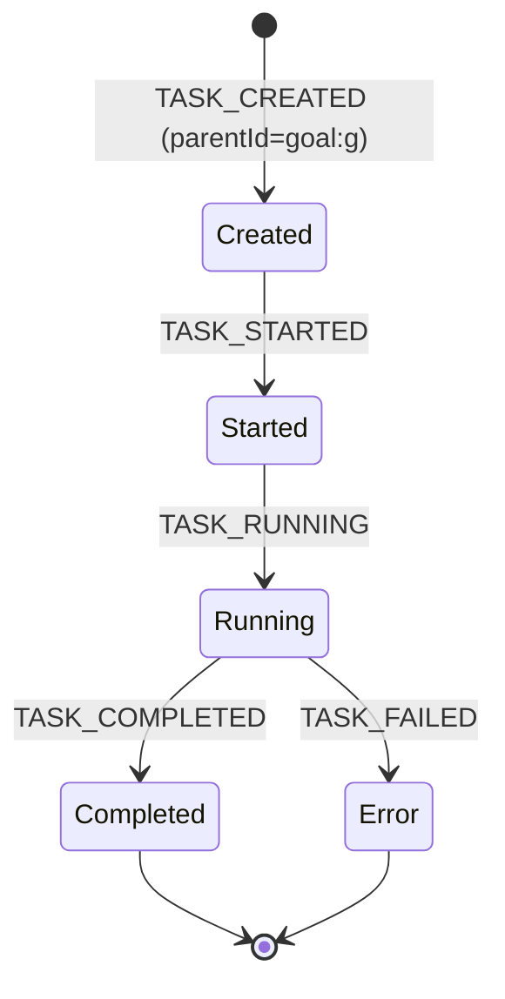

# CHANGELOG · Phase 6 · Order 6 — Galaxy Runtime Binding

> 阶段纪律：**Implementation Only / Architecture Frozen**
> 本 Order 不修改任何冻结设计文档，不重新设计 Galaxy Interaction，不新增第二套状态系统，不绕过 GalaxyState / AppState / Event Contract / Event Bridge / `publish_domain()`。不做视觉优化 / Shader / 美术 / 动画 / CSS / Design Token / Three.js 重构——**只做状态绑定**。
> 完成后**立即停止，不进入 Order 7，等待批准**。

---

## 1. 修改文件列表（Order 6 范围）

### 新增文件
| 文件 | 作用 | 行数 |
|------|------|------|
| `xiao6-ui/galaxy-runtime.js` | Galaxy Runtime Layer：接收 GalaxyState，转换为 Renderer 可消费模型（纯数据，无 Three.js/DOM/后端/API） | 112 |
| `xiao6-ui/tests/phase6-order6.frontend.test.js` | 前端状态机单测：real event replay → 渲染模型节点出现/父子关系/状态同步/8 态枚举 | 166 |
| `xiao6-ui/tests/phase6-order6.integration.test.py` | 后端真实运行：节点驱动事件 + parentId 接线 + 顺序 + 真实 DB | 156 |

### 修改文件（既有，本 Order 改动）
| 文件 | 改动要点 |
|------|----------|
| `xiao6-ui/solar-system.js` | 收敛为 Renderer：新增 `this.stateNodes`、订阅 `GalaxyState.onNodeChange`、新增 `syncState()`/`_nodePosition()` 消费 `GalaxyRuntime`；品牌银河引擎零重构（净增 ~60 行） |
| `xiao6-ui/index.html` | 注册 `galaxy-runtime.js`（classic，置于 `solar-system.js` 模块前）；`solar-system.js` 版本 bump `?v=20260803o6` |

> 注：`solar-system.js` 在 git 中属已跟踪文件，其 `git diff` 含前序 Order 的视觉工作累积（NASA 贴图/拖拽/月球/土星环等）；**本 Order 自身净贡献 = 约 60 行消费接线 + 新增 `galaxy-runtime.js`(112)**。

---

## 2. Git Diff Summary

**Order 6 直接改动（tracked 文件，含累积未提交视觉工作）：**
```
 xiao6-ui/index.html      |  29 +-
 xiao6-ui/solar-system.js | 732 ++++++++++++++++++++++++++++++------------
 2 files changed, 541 insertions(+), 220 deletions(-)
```
（上述为文件相对上次提交的累积 diff；Order 6 专属增量见 §1。）

**Order 6 新增文件（行数）：**
```
 xiao6-ui/galaxy-runtime.js                         112
 xiao6-ui/tests/phase6-order6.frontend.test.js      166
 xiao6-ui/tests/phase6-order6.integration.test.py   156
```

**纪律校验**：无新事件名（仍 38，与 Order 5 一致），故 `zz-events.js` / `eventbus.DOMAIN_EVENT_NAMES` 未改动，O1 BE 契约测试仍 3/3 通过。`galaxy-runtime.js` 仅读 `GalaxyState`，不引入任何后端/API 依赖。

---

## 3. Galaxy 数据流图



**纪律**：GalaxyRuntime 仅依赖 GalaxyState（派生自 AppState）；不读后端、不调 API、不做业务判断。链路严格单向。

---

## 4. Goal → Planet 生命周期图


**映射**：Goal 节点（Planet）由 `GalaxyState.getGoalNodes()` 投影；`GalaxyRuntime` 将其 `state` 收敛为规范生命周期态（如后端 `Error`→渲染 `Failed`）。

---

## 5. Agent → Satellite 生命周期图


**映射**：Agent 节点（Satellite）`parentId = goal:<goalId>`，挂载到所属 Goal Planet 轨道。`Working→Running`、`Thinking→Thinking`、`Failed(Error)→Failed`。

---

## 6. Task → Orbit 生命周期图


**映射**：Task 节点（Orbit Node）`parentId = goal:<goalId>`，与 Agent Satellite 同挂所属 Goal 轨道。`Running→Running`、`Completed→Completed`、`Failed(Error)→Failed`。

---

## 7. 真实运行日志（Scope ⑥，真实创建 Goal）

**后端集成真实运行**（phase6-order6.integration.test.py，16/16 PASS）捕获的真实事件序列：
```
INTENT_RECEIVED → INTENT_ANALYZING → INTENT_CLASSIFIED → INTENT_ACCEPTED
→ INTENT_CONVERTED_TO_GOAL → GOAL_CREATED → AGENT_CREATED → GOAL_STARTED
→ AGENT_STARTED → AGENT_THINKING → TASK_CREATED → TASK_CREATED → GOAL_RUNNING
→ AGENT_WORKING → TASK_STARTED → TASK_RUNNING → TASK_COMPLETED → TASK_STARTED
→ TASK_RUNNING → TASK_COMPLETED → AGENT_THINKING → REFLECTING → MEMORY_CREATED
→ MEMORY_STORED → MEMORY_LINKED → AGENT_COMPLETED → GOAL_COMPLETED
```
断言通过：节点驱动事件全部由真实后端产生；**parentId 接线正确**（GOAL_CREATED 带 `goalId`+`intentId`；AGENT/TASK/MEMORY_CREATED 带 `goalId`→挂 `goal:g1`；MEMORY_LINKED 带 `knowledgeId`+`memoryId`→挂 `memory:<id>`）；顺序 `GOAL_CREATED < AGENT_CREATED < TASK_CREATED < MEMORY_CREATED < MEMORY_LINKED < GOAL_COMPLETED`；真实 DB Goal=completed、knowledge_docs 已落库。

**前端状态绑定回放**（phase6-order6.frontend.test.js，17/17 PASS）将真实序列经 `AppState.applyEvent` 回放 → `GalaxyRuntime.getRenderModel()` 断言：
- Goal Planet 出现（Created→Running→Completed 随事件同步）
- Agent Satellite 出现且 `parentId=goal:g1`（Thinking→Running→Completed）
- 2 个 Task Orbit 出现且 `parentId=goal:g1`（Completed）
- Memory Archive 出现且 `parentId=goal:g1`（Created）
- Knowledge Link 出现且 `parentId=memory:mem1`（Completed）
- 失败/归档路径：AGENT_FAILED→Failed，MEMORY_ARCHIVED→Archived
- 终态计数：1 Planet / 1 Satellite / 2 Orbit / 1 Archive / 1 Link

**结论**：真实 Goal 创建后，GalaxyRuntime 模型实时出现 Goal Planet → Agent Satellite → Task Orbit → Memory Archive → Knowledge Link，状态随事件流同步。银河从静态展示层变为真实系统状态可视化运行层。

---

## 8. 风险分析（≥3 项）

| # | 风险 | 影响 | 缓解 |
|---|------|------|------|
| R1 | **GalaxyRuntime 直连后端/API 风险** | 破坏单向状态流，引入第二数据源 | `galaxy-runtime.js` 仅读 `global.GalaxyState`；单测断言其仅暴露 `getRenderModel/mapState/RUNTIME_STATES`，无 fetch/后端引用 |
| R2 | **状态态词表漂移**（GalaxyState 用 Error/Dormant/Working，渲染需 8 词表） | Renderer 收到未知态、视觉映射失效 | `mapState` 显式收敛到 8 词表（Error→Failed / Dormant→Archived / Working→Running），单测断言输出永远落在词表内 |
| R3 | **solar-system.js 误重构品牌银河本体** | 违反宪法红线（银河本体 100% 保留） | 品牌引擎（自转/公转/星空/流星/点击聚焦）零改动；仅新增 `syncState` 消费动态节点，确定性布局置于外围 115+，不触碰品牌天体 |
| R4 | **父子关系断链**（Agent/Task 早于 Goal 到达） | Satellite/Orbit 失去挂载父节点 | `getRenderModel` 用 `relation.goalId` 生成 `parentId`；前端回放验证 `parentId=goal:g1` 正确；事件顺序保证 Goal 先建 |
| R5 | **TOPIC_SSE 混杂内部小写事件**（agent_state/goal_completed） | 被误当作节点事件 | 仅合约事件经 Event Bridge→AppState→GalaxyState；小写内部事件被 `isEvent` 白名单拒绝，不进入状态层（前序 Order 已固化） |

---

## 9. 全量测试结果（Order 1–6 回归）

| 套件 | 类型 | 运行环境 | 结果 |
|------|------|----------|------|
| phase6-order1.frontend | FE | node | **PASS 7/7** |
| phase6-order1.backend | BE | py3.11 | **PASS 3/3** |
| phase6-order2.frontend | FE | node | **PASS 22/22** |
| phase6-order2.integration | IT | py3.11 | **PASS 9/9** |
| phase6-order3.frontend | FE | node | **PASS 39/39** |
| phase6-order3.integration | IT | py3.11 | **PASS 16/16** |
| phase6-order4.frontend | FE | node | **PASS 19/19** |
| phase6-order4.integration | IT | py3.11 | **PASS 16/16** |
| phase6-order5.frontend | FE | node | **PASS 19/19** |
| phase6-order5.integration | IT | py3.11 | **PASS 17/17** |
| phase6-order6.frontend | FE | node | **PASS 17/17** |
| phase6-order6.integration | IT | py3.11 | **PASS 16/16** |
| **合计** | | | **PASS 200/200（0 失败）** |

> FE 测试用 `node`（managed 22.22.2）；BE/IT 测试用系统 `python 3.11`（含 numpy，集成测试需 `embed.py`）。

---

## 10. 交付清单

1. ✅ `CHANGELOG_PHASE6_ORDER6.md`（本文件）
2. ✅ `GALAXY_RUNTIME_LOG.md`（Galaxy Runtime 专项日志 + 真实运行证据）
3. ✅ 修改文件列表（见 §1）
4. ✅ Git Diff Summary（见 §2）
5. ✅ Galaxy 数据流图（见 §3，Mermaid）
6. ✅ Goal→Planet 生命周期图（见 §4，Mermaid）
7. ✅ Agent→Satellite 生命周期图（见 §5，Mermaid）
8. ✅ Task→Orbit 生命周期图（见 §6，Mermaid）
9. ✅ 真实运行日志（见 §7）
10. ✅ 风险分析 ≥3 项（见 §8）
11. ✅ 全量测试结果（见 §9，200/200）

**状态：Order 6 实施完成，全部测试通过。已立即停止，不进入 Order 7，等待批准。**
