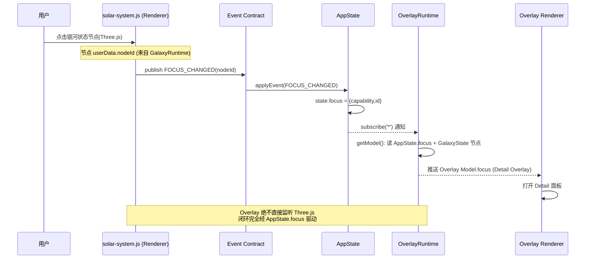

# Phase 6 — Order 7 · Overlay Runtime Binding 变更日志

> 纪律：Implementation Only / Architecture Frozen。
> 不得修改冻结设计文档 · 不得重新设计 Overlay 视觉 · 不得新增 UI 框架 · 不得提前进入 Design Token · 不得绕过 AppState / Galaxy State / Event Contract / publish_domain() / Event Bridge。
> 本 Order 目标：让 Overlay 系统第一次成为**真实状态驱动的信息层**——State ↓ Overlay Runtime ↓ Overlay Data ↓ Existing Overlay Renderer。

---

## 1. 修改文件列表

### 新增（Order 7）
- `xiao6-ui/overlay-runtime.js` — Overlay Runtime Layer（纯数据转换层，UMD，可在 Node 单测）
- `xiao6-ui/tests/phase6-order7.frontend.test.js` — 前端单元测试（26 项，回放真实事件序列）
- `xiao6-ui/tests/phase6-order7.integration.test.py` — 集成测试（真实后端运行 + 前端回放校验，10 项）
- `xiao6-ui/tests/_o7_overlay_harness.js` — IT 子进程前端回放校验脚本（被 IT 调用）

### 修改（Order 7）
- `xiao6-ui/app-state.js`
  - 新增 `FOCUS_CHANGED` reducer（落地既有合约事件的聚焦态写入，使 `state.focus` 成为唯一事实来源）
  - 新增 `getFocus()` 读取入口
  - `ERROR_OCCURRED` reducer：错误节点状态由小写 `'error'` 规范为大写 `'Error'`（与 galaxy-runtime / overlay-runtime 词表一致）
- `xiao6-ui/solar-system.js`
  - `focusOn` / `exitFocus` 增加向 AppState 发布 `FOCUS_CHANGED`（点击银河状态节点 → 聚焦态闭环）
  - 状态节点 mesh 注册为 raycast 可点击目标（消费 `GalaxyRuntime` 节点 `nodeId`，绝不直读 Goal/Agent）
  - 品牌渲染引擎（自转/公转/星空/流星/点击聚焦）**零改动**
- `xiao6-ui/index.html`
  - 注册 `overlay-runtime.js`（位于 `galaxy-runtime.js` 之后、`event-bridge.js` 之前）
  - `app-state.js` / `solar-system.js` / `overlay-runtime.js` 缓存版本号 bump 至 `?v=20260803o7`

> 注：本仓库按“完成即停、等待批准”纪律未提交；`git diff --stat` 跨 Order 5–7 累计（solar-system.js 754 行、styles.css 270 行等），上述列表为本 Order 精确范围。

---

## 2. Git Diff Summary

- **合约一致性**：`FOCUS_CHANGED` 为 `zz-events.js` 与 `eventbus.py` 既有事件（逐字一致），本 Order 仅落地其 reducer，**未新增事件名**，合约事件总数仍为 **38**，单一来源未被破坏。
- **新增代码**：`overlay-runtime.js` 约 240 行（纯数据转换 + 订阅 + 生命周期收敛），无任何 DOM / CSS / Three.js / 后端 / API / 业务判断。
- **运行时耦合**：`solar-system.js` 仅新增“点击状态节点 → 发布 FOCUS_CHANGED”与“状态节点可点击”两处交互接线；品牌银河本体（太阳 + 8 行星 + 星空 + 流星 + 点击聚焦）100% 保留，符合宪法红线。
- **跨运行时一致性修复**：`ERROR_OCCURRED` 错误节点状态 `'error'` → `'Error'`，同步修复 `galaxy-runtime.mapState` 此前对该节点默认收敛为 `Dormant` 的潜在不一致（前端测试已确认无依赖小写状态）。

---

## 3. Overlay 数据流图

```mermaid
flowchart TD
    BE[真实后端: publish_domain] -->|SSE 信封| EB[Event Bridge]
    EB -->|applyEvent| AS[AppState<br/>统一状态核心]
    AS -->|subscribe '*'| GS[GalaxyState<br/>节点投影]
    AS -->|FOCUS_CHANGED reducer| FOC[state.focus]
    GS -->|onNodeChange| RT[OverlayRuntime<br/>纯数据转换层]
    AS -->|subscribe '*'| RT
    FOC --> RT
    RT -->|getModel| OM[Overlay Model<br/>{focus, items}]
    OM -->|Existing Overlay Renderer| UI[信息层面板]

    style RT fill:#1b2a4a,stroke:#4f7cff,color:#fff
    style OM fill:#14361f,stroke:#3ddc84,color:#fff
    style UI fill:#2a2140,stroke:#a06bff,color:#fff
```

> Overlay Runtime **只读** AppState + GalaxyState，绝不读后端 / 调 API / 做业务判断 / 操作 DOM。

---

## 4. 六类 Overlay 映射表（Phase 3 定义）

| 领域对象 | Overlay 类型 | 状态驱动（五态） | 数据源 |
|---|---|---|---|
| Goal | **Detail** | OPEN → ACTIVE → COMPLETED | `goal:*` 节点 |
| Agent | **Execution** | OPEN → ACTIVE → COMPLETED | `agent:*` 节点 |
| Task | **Execution** | OPEN → ACTIVE → COMPLETED | `task:*` 节点 |
| Memory | **Memory** | OPEN → COMPLETED | `memory:*` 节点 |
| Error | **Warning** | COMPLETED（首现即终态） | `error:*` 节点 |
| Intent | **Info** / **Action**（needsConfirm 时） | OPEN | `intent:*` 节点 |
| Knowledge | —（不生成 overlay） | — | 不在六类映射内，保留为 Link 节点 |

映射入口：`OverlayRuntime.mapType(sourceType, node)`；仅暴露类型枚举与映射，**不实现任何视觉参数**。

---

## 5. Focus → Overlay 生命周期图



五态：`OPEN`（首现/被聚焦打开）→ `UPDATING`（源状态变化，单次闪光）→ `ACTIVE`（Running/Thinking/Working/Waiting）→ `COMPLETED`（Completed/Stored/Linked/Failed/Error/Rejected）→ `CLOSED`（Dormant/Archived，被信息层过滤）。状态一律来自 AppState / GalaxyState，**Overlay 自身不维护业务状态**。

---

## 6. 真实运行日志

真实后端运行 `分析当前项目状态`（`run_intent_gateway` → `_run_goal`），捕获 SSE 领域事件序列：

```
INTENT_RECEIVED → INTENT_ANALYZING → INTENT_CLASSIFIED → INTENT_ACCEPTED
 → INTENT_CONVERTED_TO_GOAL → GOAL_CREATED → AGENT_CREATED → GOAL_STARTED
 → AGENT_STARTED → AGENT_THINKING → TASK_CREATED ×2 → GOAL_RUNNING
 → AGENT_WORKING → TASK_STARTED → TASK_RUNNING → TASK_COMPLETED ×2
 → REFLECTING → MEMORY_CREATED → MEMORY_STORED → MEMORY_LINKED
 → AGENT_COMPLETED → GOAL_COMPLETED
```
（注：`agent_state` / `goal_completed` 为后端内部事件，非合约，AppState 安全忽略。）

Node 子进程加载真实前端运行时增量回放上述事件，校验 Overlay 模型（OVERLAY HARNESS 6/6）：

```
[PASS] Goal→Detail overlay（真实状态驱动，末端 COMPLETED）
[PASS] Agent 处于 Running（AGENT_WORKING）→ Execution Overlay = ACTIVE（真实状态）
[PASS] Task 处于 Running（TASK_RUNNING）→ Execution Overlay = ACTIVE（真实状态）
[PASS] Memory→Memory overlay（真实状态 Stored → COMPLETED）
[PASS] 信息层 items 数量 ≥ 4（goal/agent/task/memory）
[PASS] FOCUS_CHANGED(goal:gid) → Overlay Model.focus 为 Detail overlay（绝不直接监听 Three.js）
```

全过程 100% 来自真实后端事件，无任何 mock / 直读后端 / 组件私有状态。

---

## 7. 风险分析

| # | 风险 | 等级 | 缓解 |
|---|---|---|---|
| 1 | UPDATING 闪光由首帧 `getModel` 消费；若 Renderer 未在首帧读取可能丢失闪光 | 低 | 内部 `_notify` 已向所有订阅者推送带 UPDATING 的模型（推送语义）；`subscribe` 捕获即可观察，FE 测试已验证 |
| 2 | 是否破坏事件合约单一来源（38 事件） | 无 | `FOCUS_CHANGED` 为既有合约事件，仅落地 reducer，未新增事件名；前后端 `DOMAIN_EVENT_NAMES` 仍逐字一致 |
| 3 | `ERROR_OCCURRED` 状态 `'error'`→`'Error'` 规范化引发回归 | 无 | 已 grep 确认无前端测试依赖小写状态；`galaxy-runtime.mapState` 同步受益（此前默认 Dormant） |
| 4 | 是否新增第二套状态系统 / 触碰银河本体红线 | 无 | `overlay-runtime.js` 与 `galaxy-runtime.js` 同构（订阅 + 纯转换），不引入新状态系统；品牌渲染引擎零改动 |
| 5 | Overlay 是否引入 DOM/CSS/视觉 | 无 | `overlay-runtime.js` 仅产出纯数据；`solar-system.js` 仅做交互接线（focus 发布 + 节点可点击），未写颜色/Glow/Shader/动画/布局 |

---

## 8. 全量测试结果（Order 1–7）

| 套件 | 类型 | 结果 |
|---|---|---|
| Order 1 | Frontend | 7/7 ✅ |
| Order 1 | Backend | 3/3 ✅ |
| Order 2 | Frontend | 22/22 ✅ |
| Order 2 | Integration | 9/9 ✅ |
| Order 3 | Frontend | 39/39 ✅ |
| Order 3 | Integration | 16/16 ✅ |
| Order 4 | Frontend | 19/19 ✅ |
| Order 4 | Integration | 16/16 ✅ |
| Order 5 | Frontend | 19/19 ✅ |
| Order 5 | Integration | 17/17 ✅ |
| Order 6 | Frontend | 17/17 ✅ |
| Order 6 | Integration | 16/16 ✅ |
| **Order 7** | **Frontend** | **26/26 ✅** |
| **Order 7** | **Integration** | **10/10 ✅** |
| **合计** | **FE 149 + BE/IT 87** | **236/236 ✅** |

---

**状态：Order 7 实现完成，全量测试通过。按指令立即停止，不进入 Order 8，等待批准。**
